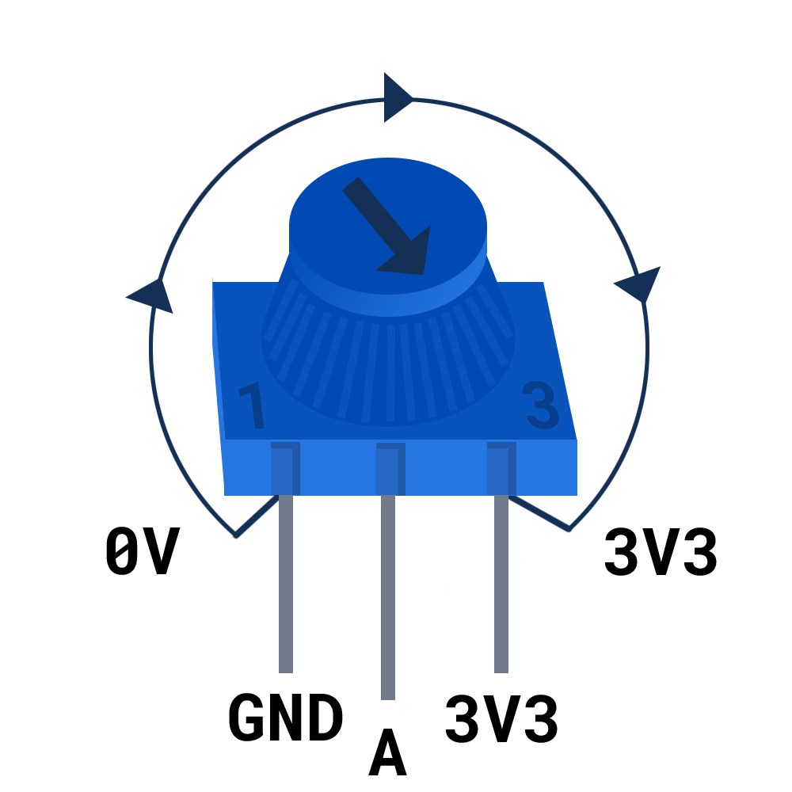

You will need:

+ A Raspberry Pi Pico
+ A potentiometer
+ 3 x socket-socket jumper wires

A **potentiometer** has three pins:
- Ground
- Analogue signal
- 3V3 (power)

When the potentiometer is turned all the way to the **left** the arrow points to the **GND** pin, when it is turned all the way to the **right**, the arrow points to the **3V3** pin. The middle pin is the pin that the Raspberry Pi Pico reads a value from.

{:width="400px"}

**Connect:** Find three socket-socket jumper wires and attach one to each leg of the potentiometer. You may wish to secure the legs with some electrical tape if they feel loose.

Connect the other end of each jumper to the Raspberry Pi Pico:

+ Connect the labelled with a small 1 to the **GND** pin between **GP21** and **GP22**.
+ Connect the middle pin the **GP26_A0**. This is an analogue pin.
+ Connect pin labelled with a small 3 to the **3V3** pin.

